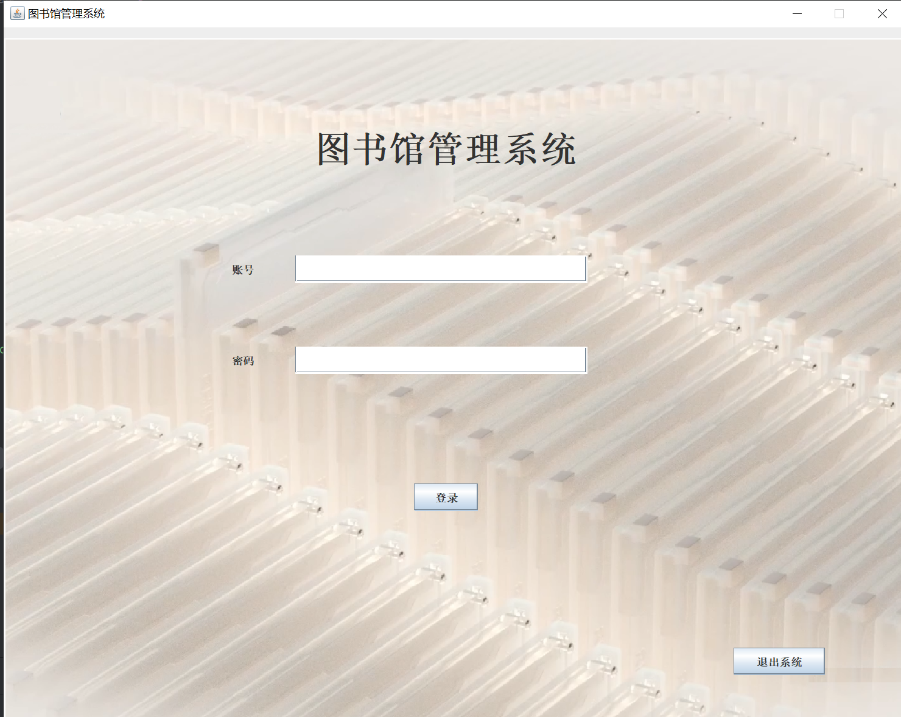
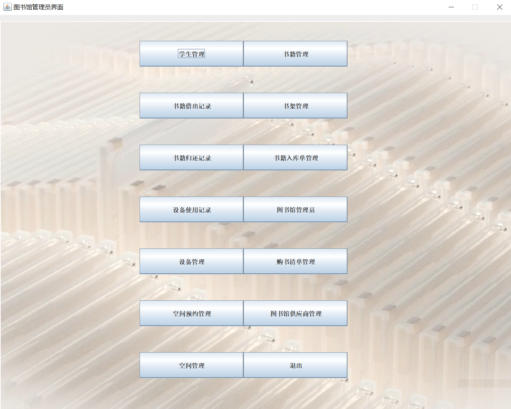
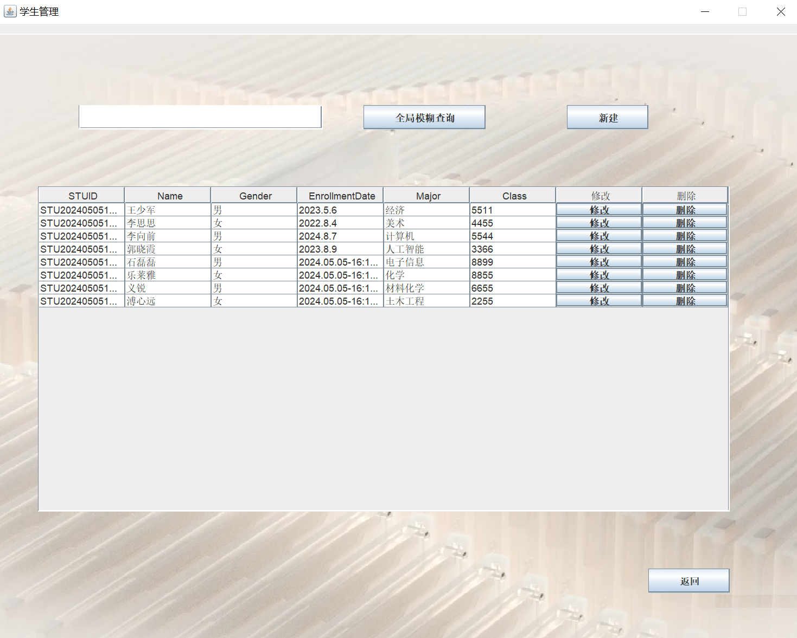
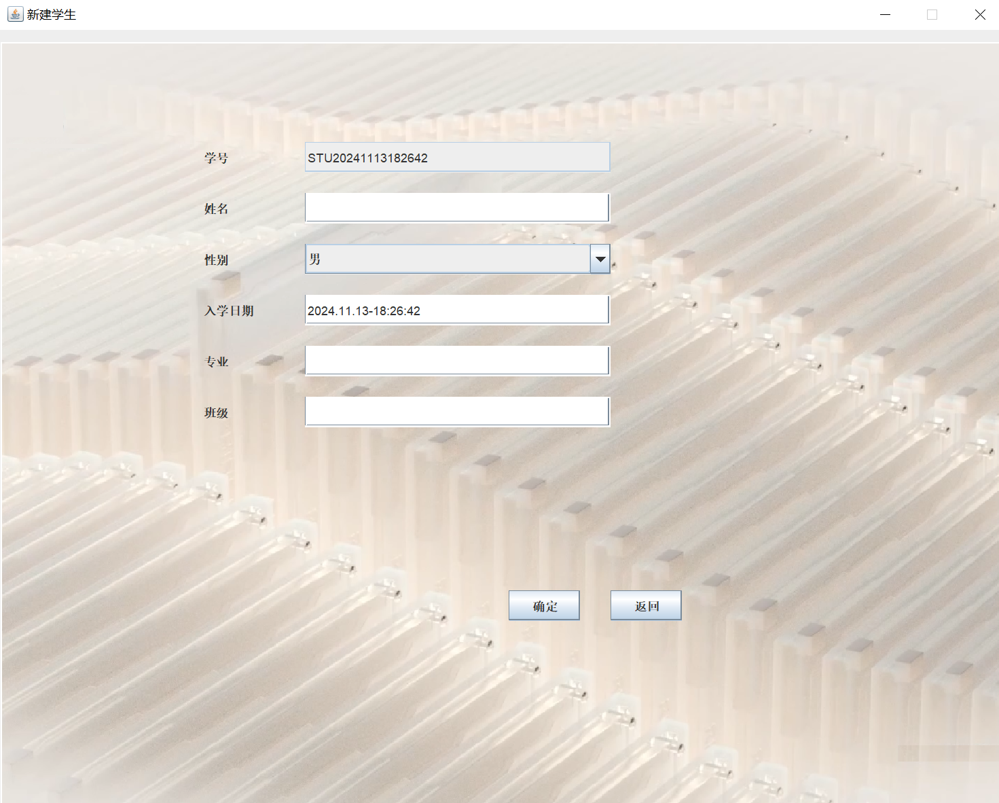
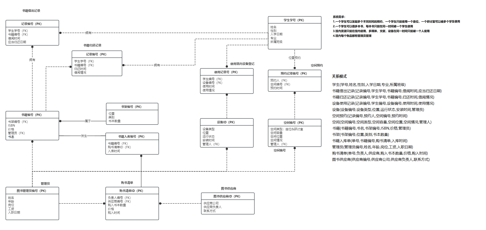

# LibraryDBMS

### 环境配置

本项目的数据存储基于mysql，需要安装idea后连接数据库
mysql安装方法：https://blog.csdn.net/wer24_25/article/details/139959655

请注意登录自己的数据库需要更换代码中连接数据库的账号密码，完成之后请点击LibraryTableCreator.sql文件运行创建表的脚本完成数据表创建

### 操作方法和功能介绍

运行Windows.java,登录界面的初始管理员账号和密码都是空，点击登录即可

进入之后可以选择功能，对各种事务进行管理

以学生管理为例，界面实现了增删改查功能，查询可以使用数据库的通配符，点击修改或者新建会进入信息界面可以对允许的数据项进行修改，由于数据之间的依赖特性，删除时请注意是否有其他数据对这个数据产生依赖，否则无法删除

### IDEF1X图设计

